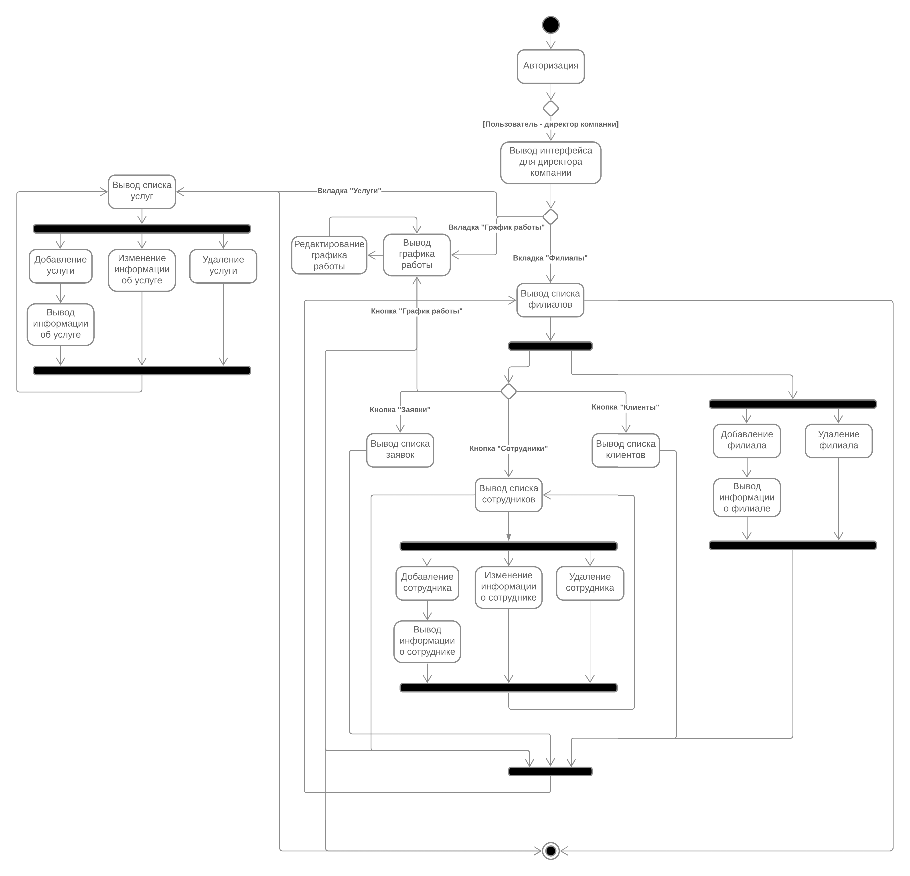
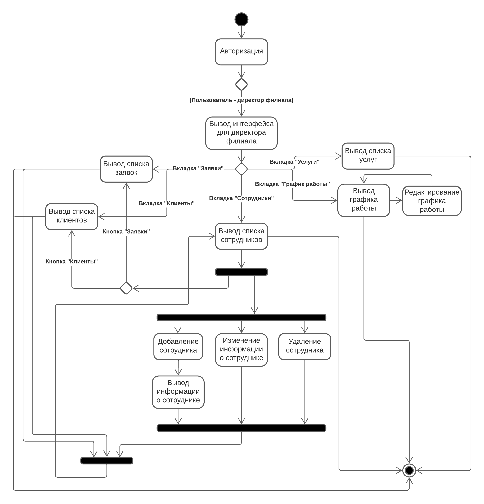
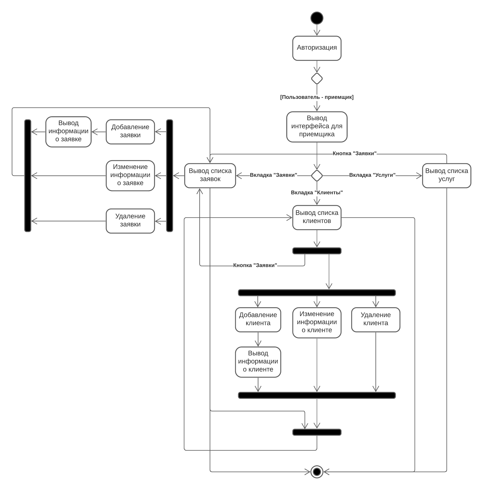
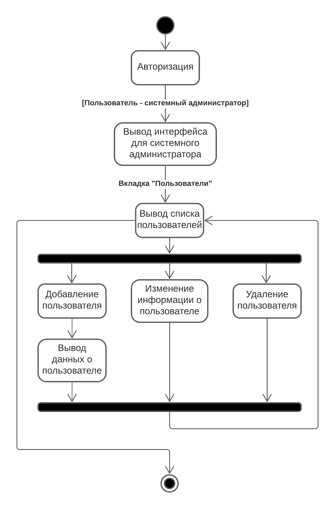

## Диаграммы действий

+ Диаграмма описывает деятельность директора компании. 
После авторизации для директора компании выводится пользовательский интерфейс, где он может выбрать нужную вкладку («Услуги», «График работы» или «Филиалы»). После выбора вкладки выводится список услуг, график работы или список филиалов. 
Директор компании может добавлять новую услугу, редактировать определенную услугу или удалить, добавить филиал или удалить. На вкладке филиалы директор компании может нажать нужную кнопку («Заявки», «Сотрудники», «Клиенты», «График работы»). 
Нажав на кнопку «Заявки», выводится список заявок определенного филиала, так же с графиком работы, клиентами и сотрудниками (директор компании может добавить нового сотрудника, редактировать информацию об определенном сотруднике или удалить его). 

+ Диаграмма описывает деятельность директора филиала.
После авторизации для директора филиала выводится пользовательский интерфейс, где он может выбрать нужную вкладку («Заявки», «Клиенты», «Услуги», «График работы», «Сотрудники»). После выбора вкладки выводится список заявок, клиентов, услуг, сотрудников или график работы. 
Директор филиала может редактировать график работы, добавить нового сотрудника, редактировать информацию об определенном сотруднике или удалить.

+ Диаграмма описывает деятельность приемщика.
После авторизации для приемщика выводится пользовательский интерфейс, где он может выбрать нужную вкладку («Заявки», «Клиенты», «Услуги»). После выбора вкладки выводится список заявок, клиентов или услуг. 
Приемщик может создать нового клиента, редактировать информацию об определенном клиенте или удалить. Те же самые действия он может выполнять с заявками.

+ Диаграмма описывает деятельность системного администратора.
После авторизации для системного администратора выводится пользовательский интерфейс, где он может выбрать вкладку «Пользователи». После выбора вкладки выводится список пользователей. 
Системный администратор может создать нового пользователя, редактировать информацию об определенном пользователе или удалить.
