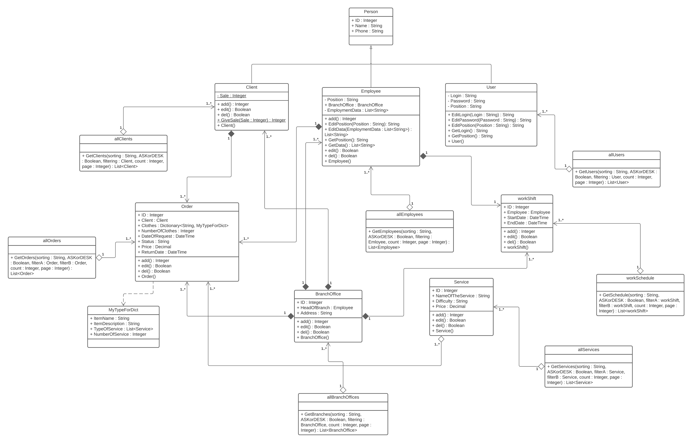

## Диаграмма классов

### Описание классов

#### *Person*
Класс Person является абстрактным и родителем классов Client, Employee, User.  Этот класс содержит атрибуты: ID, Name, Phone. 

#### *User*

Данный класс наследует все атрибуты класса Person. А также он содержит атрибуты: Login, Password, Position.
+ +EditLogin(Login : String) – функция с входным параметром «Login», позволяющая редактировать логин пользователя. 
+ +EditPassword(Password : String) – функция с входным параметром «Password», позволяющая редактировать пароль пользователя.
+ +EditPosition(Position : String) – функция с входным параметром «Position», которая позволяет редактировать должность пользователя.
+ +GetLogin() – функция, возвращающая логин текущего пользователя.
+ +GetPosition() – функция, возвращающая должность текущего пользователя.
+ +User() – конструктор класса User.

#### *allUsers*

Класс, связанный агрегацией «один-ко-многим» с классом User. Содержит открытую функцию «GetUsers».
+ +GetUsers(sorting : String, ASKorDESK : Boolean, filtering : User, count : Integer, page : Integer) : List<User> – функция с входными параметрами «sorting» - сортировка, «ASKorDESK» - по возрастанию/по убыванию, «filtering» - фильтрация, «count» - количество, «page» - страница. Функция возвращает список пользователей.

#### *[Employee](Employee.md)*

Класс, являющийся наследником класса Person и связанный композициями «один-ко-многим» и «один-к-одному» с классами Order и workShift, соответственно. Содержит атрибуты: Position, BranchOffice, EmploymentData.
+ +add() – функция добавления сотрудника в БД, возвращает ID сотрудника.
+ +EditPosition(Position : String) – функция с входным параметром «Position», позволяющая редактировать должность сотрудника
+ +EditData(EmploymentData : List<String>) – функция с входным параметром «EmploymentData», позволяющая редактировать данные для трудоустройства.
+ +GetPosition() – функция, возвращающая должность сотрудника.
+ +GetData() – функция, возвращающая данные сотрудника, необходимые для трудоустройства.
+ +edit() – функция редактирования данных о сотруднике, возвращает True/False.
+ +del() – функция удаления сотрудника из БД, возвращает True/False.
+ +Employee() – конструктор класса Employee.

#### *allEmployees*

Класс, связанный агрегацией «один-ко-многим» с классом Employee. Содержит открытую функцию «GetEmloyees».
+ +GetEmployees(sorting : String, ASKorDESK : Boolean, filtering : Emloyee, count : Integer, page : Integer) : List<Employee> - функция с входными параметрами «sorting» - сортировка, «ASKorDESK» - по возрастанию/по убыванию, «filtering» - фильтрация, «count» - количество, «page» - страница. Функция возвращает список сотрудников.

#### *[Client](Client.md)*

Класс, являющийся наследником класса Person, связан с классом Order композицией «один-ко-многим». Содержит атрибут Sale (скидка).
+ +add() – функция добавления клиента в БД, возвращает ID клиента.
+ +edit() – функция редактирования данных о клиенте, возвращает True/False.
+ +del() – функция удаления клиента из БД, возвращает True/False.
+ +GiveSale(Sale : Integer) – статичная функция с входным параметром «Sale», позволяющая предоставить клиенту скидку на услуги.
+ +Client() – конструктор класса Client.

#### *allClients*

Класс, связанный агрегацией «один-ко-многим» с классом Client. Содержит открытую функцию «GetClients».
+ +GetClients(sorting : String, ASKorDESK : Boolean, filtering : Client, count : Integer, page : Integer) : List<Client> - функция с входными параметрами «sorting» - сортировка, «ASKorDESK» - по возрастанию/по убыванию, «filtering» - фильтрация, «count» - количество, «page» - страница. Функция возвращает список клиентов.

#### *[Order](Order.md)*

Класс, отображающий данные о заявке. Содержит атрибуты: ID, Client, Clothes, NumberOfClothes, DateOfRequest, Price, ReturnDate. Связан с классом MyTypeForDict, при оформлении заявки необходимо описать вещь и услуги.
+ +add() – функция добавления заявки в БД, возвращает ID заявки.
+ +edit() – функция редактирования данных о заявке, возвращает True/False.
+ +del() – функция удаления заявки из БД, возвращает True/False.
+ +Order() – конструктор класса Order.

#### *allOrders*

Класс, связанный агрегацией «один-ко-многим» с классом Order. Содержит открытую функцию «GetOrders».
+ +GetOrders(sorting : String, ASKorDESK : Boolean, filterA : Order, filterB : Order, count : Integer, page : Integer) : List<Order> - функция с входными параметрами «sorting» - сортировка, «ASKorDESK» - по возрастанию/по убыванию, «filterA» - фильтр, «filterB» - фильтр (необходим для интервала количественных атрибутов), «count» - количество, «page» - страница. Функция возвращает список заявок.

#### *[BranchOffice](BranchOffice.md)*

Класс, отображающий данные о филиале, связанный композициями «один-ко-многим» с классами Client, Order, Employee, workShift. Содержит атрибуты: HeadOfBranch, Address.
+ +add() – функция добавления филиала в БД.
+ +edit() – функция редактирования данных о филиале, возвращает True/False.
+ +del() – функция удаления филиала из БД, возвращает True/False.
+ +BranchOffice() – конструктор класса BranchOffice.

#### *allBranchOffices*

Класс, связанный агрегацией «один-ко-многим» с классом BranchOffice. Содержит открытую функцию «GetBranches».
+ +GetBranches(sorting : String, ASKorDESK : Boolean, filtering : BranchOffice, count : Integer, page : Integer) : List<BranchOffice> - функция с входными параметрами «sorting» - сортировка, «ASKorDESK» - по возрастанию/по убыванию, «filtering» - фильтрация, «count» - количество, «page» - страница. Функция возвращает список филиалов.

#### *[Service](Service.md)*

Класс, отображающий данные об услуге и связанный с классом Order агрегацией «многие-ко-многим». Содержит атрибуты: ID, NameOfTheService, Difficulty, Price.
+ +add() – функция добавления услуги в БД, возвращает ID услуги.
+ +edit() – функция редактирования данных об услуге, возвращает True/False.
+ +del() – функция удаления услуги из БД, возвращает True/False.
+ +Service() – конструктор класса Service.

#### *allServices*

Класс, связанный агрегацией «один-ко-многим» с классом Service. Содержит открытую функцию «GetServices».
+ +GetServices(sorting : String, ASKorDESK : Boolean, filterA : Service, filterB : Service, count : Integer, page : Integer) : List<Service> - функция с входными параметрами «sorting» - сортировка, «ASKorDESK» - по возрастанию/по убыванию, «filterA» - фильтр, «filterB» - фильтр (необходим для интервала количественных атрибутов), «count» - количество, «page» - страница. Функция возвращает список услуг (прайс-лист).

#### *[workShift](workShift.md)*

Класс, отображающий данные о смене сотрудника. Содержит атрибуты: Employee, Condition, StartDate, EndDate.
+ +add() – функция добавления смены в БД.
+ +edit() – функция редактирования данных о смене, возвращает True/False.
+ +del() – функция удаления смены из БД, возвращает True/False.
+ +workShift() – конструктор класса workshift.

#### *workSchedule*

Класс, связанный агрегацией «один-ко-многим» с классом workShift. Содержит открытую функцию «GetSchedule».
+ +GetSchedule(sorting : String, ASKorDESK : Boolean, filterA : workShift, filterB : workShift, count : Integer, page : Integer) : List<workShift> - функция с входными параметрами «sorting» - сортировка, «ASKorDESK» - по возрастанию/по убыванию, «filterA» - фильтр, «filterB» - фильтр (необходим для интервала количественных атрибутов), «count» - количество, «page» - страница. Функция возвращает список смен (график работы).

#### *[MyTypeForDict](MyTypeForDict.md)*

Класс, представляющий собой собственный тип данных для словаря. Содержит атрибуты: ItemName, ItemDescription, TypeOfService, NumberOfService.
