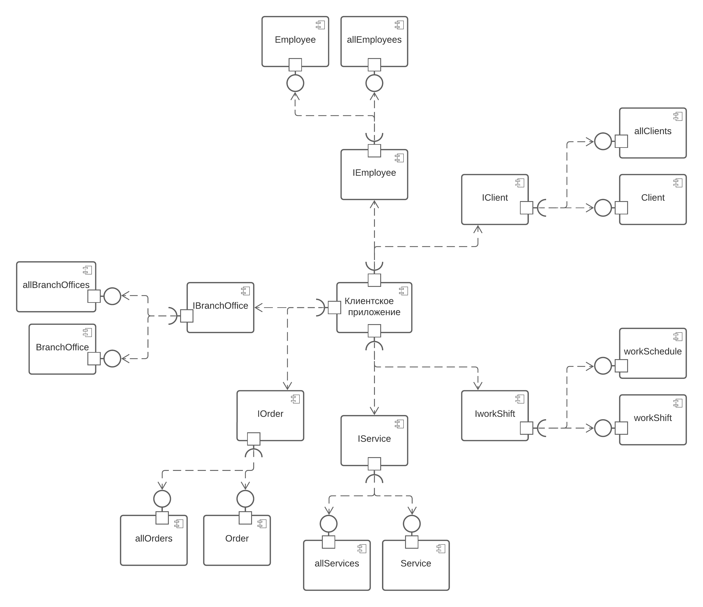

## Диаграмма компонентов

+ На данной диаграмме изображены все компоненты: клиентское приложение, клиенты, работники, заявки, филиалы, услуги, график-работы. 
Эти компоненты взаимодействуют друг с другом с помощью интерфейсов.
