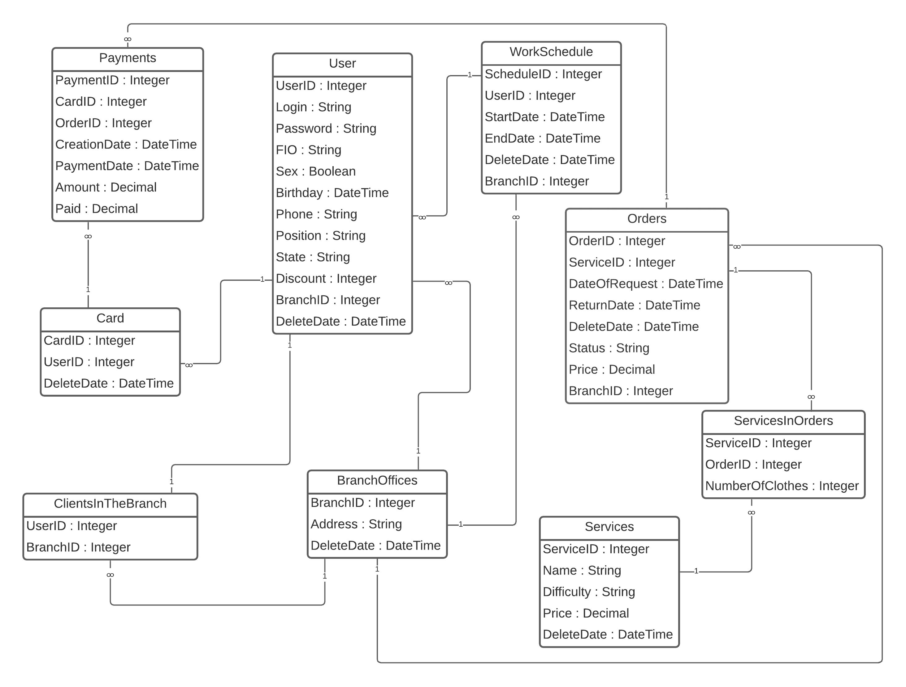

## Схема Базы Данных
 

**Описание таблицы User**

+ Название таблицы:	User.
+ Краткое описание:	В таблице хранятся данные об администраторе, сотрудниках, клиентах.
+ Первичные ключи:	UserID
+ Таблицы, связанные соединением:
    *   «один-ко-многим»:	Card (для клиентов).
    *   «многие-к-одному»: WorkSchedule(для сотрудников); BranchOffices.
    *   «один-к-одному»: ClientsInTheBranch(для клиентов).
+ Значение полей: 
    *   UserID:	Ключевое поле.
    *   Login:	Уникальный логин пользователя для авторизации.
    *   Password:	Пароль.
    *   FIO:	ФИО пользователя.
    *   Sex: Пол.
    *   Birthday: Дата рождения.
    *   Phone: Номер телефона.
    *   Position: Должность пользователя (для сотрудников).
    *   State: Статус пользователя: клиент, сотрудник, администратор.
    *   Discount: Скидка (для клиента).
    *   BranchID: Внешний ключ таблицы BranchOffices.
    *   DeleteDate: Дата удаления пользователя.

**Описание таблицы WorkSchedule**

+ Название таблицы:	WorkSchedule.
+ Краткое описание:	В таблице хранятся данные о расписании сотркудников.
+ Первичные ключи:	ScheduleID.
+ Таблицы, связанные соединением:
    *   «один-ко-многим»:	User.
    *   «многие-к-одному»: BranchOffices.
    *   «один-к-одному»: -
+ Значение полей:	
    *   ScheduleID:	Ключевое поле.
	*   UserID:	Внешний ключ таблицы User.
	*   StartDate:	Дата начала работы.
	*   EndDate:	Дата окончания работы.
	*   DeleteDate:	Дата удаления.
	*   BranchID:	Внешний ключ таблицы BranchOffices.

**Описание таблицы Orders**

+ Название таблицы:	Orders.
+ Краткое описание:	В таблице хранятся данные о заявках.
+ Первичные ключи: OrderID.
+ Таблицы, связанные соединением: 
    *   «один-ко-многим»:	Payments; ServicesInOrders.
    *   «многие-к-одному»: BranchOffices.
    *   «один-к-одному»: -	
+ Значение полей:	
    *   OrderID:	Ключевое поле.
	*   ServiceID:	Внешний ключ таблицы Services.
	*   DateOfRequest: Дата обращения.
	*   ReturnDate:	Дата возврата.
	*   DeleteDate:	Дата удаления.
	*   Status: Статус заявки.
	*   BranchID: Внешний ключ таблицы BranchOffices.

**Описание таблицы Service**

+ Название таблицы:	Service.
+ Краткое описание:	В таблице хранятся данные об услугах.
+ Первичные ключи:	ServiceID
+ Таблицы, связанные соединением: 
    *   «один-ко-многим»:	ServicesInOrders.
    *   «многие-ко-многим»:	-
    *   «один-к-одному»:	-
+ Значение полей:	
    *   ServiceID:	Ключевое поле.
	*   Name:	Название услуги.
	*   Difficulty:	Сложность исполнения.
	*   Price:	Цена услуги.
	*   DeleteDate: Дата удаления.

**Описание таблицы ServicesInOrders**

+ Название таблицы:	ServicesInOrders.
+ Краткое описание:	В таблице хранятся данные об услугах в заказе.
+ Первичные ключи:	-
+ Таблицы, связанные соединением: 
    *   «один-ко-многим»:	-
    *   «многие-к-одному»: Orders; Services.
    *   «один-к-одному»:	-
+ Значение полей:	
    *   ServiceID: Внешний ключ таблицы Services.
	*   OrderID: Внешний ключ таблицы Orders.
	*   NumberOfClothes: Количество вещей (услуг).

**Описание таблицы BranchOffices**

+ Название таблицы:	BranchOffices.
+ Краткое описание:	В таблице хранятся данные о филиалах.
+ Первичные ключи:	BranchID
+ Таблицы, связанные соединением: 
    *   «один-ко-многим»:	ClientsInTheBranch; WorkSchedule; Orders; User.
    *   «многие-ко-многим»:	-
    *   «один-к-одному»:	-
+ Значение полей:	
    *   BranchID:	Ключевое поле.
	*   Address: 	Адрес филиала.
	*   DeleteDate:	Дата удаления.

**Описание таблицы ClientsInTheBranch**

+ Название таблицы:	ClientsInTheBranch.
+ Краткое описание:	В таблице хранятся данные о клиентах в филиале.
+ Первичные ключи:	-
+ Таблицы, связанные соединением :
    *   «один-ко-многим»:	-
    *    «многие-к-одному»:	BranchOffices.
    *   «один-к-одному»: User.	
+ Значение полей:	
    *   UserID:	Внешний ключ таблицы User.
	*   BranchID:	Внешний ключ таблицы BranchOffices.

**Описание таблицы Card**

+ Название таблицы:	Card.
+ Краткое описание:	В таблице хранятся данные о карточках клиентов.
+ Первичные ключи:	CardID
+ Таблицы, связанные соединением :
    *   «один-ко-многим»:	Payments.
    *   «многие-к-одному»: User.
    *   «один-к-одному»:	-
+ Значение полей:	
    *   CardID:	Ключевое поле.
	*   UserID:	Внешний ключ таблицы User.
	*   DeleteDate:	Дата удаления.

**Описание таблицы Payments**

+ Название таблицы:	Payments.
+ Краткое описание:	В таблице хранятся данные об оплатах.
+ Первичные ключи:	PaymentID
+ Таблицы, связанные соединением: 
    *   «один-ко-многим»:	-
    *   «многие-к-одному»: Orders; Card.
    *   «один-к-одному»: -
+ Значение полей:	
    *   PaymentID:	Ключевое поле. 
	*   CardID:	Внешний ключ таблицы Card.
	*   OrderID:	Внешний ключ таблицы Orders.
	*   CreationDate:	Дата создания.
	*   PaymentDate: Дата оплаты.
	*   Amount: Итоговая сумма.
	*   Paid: Оплаченная сумма.
