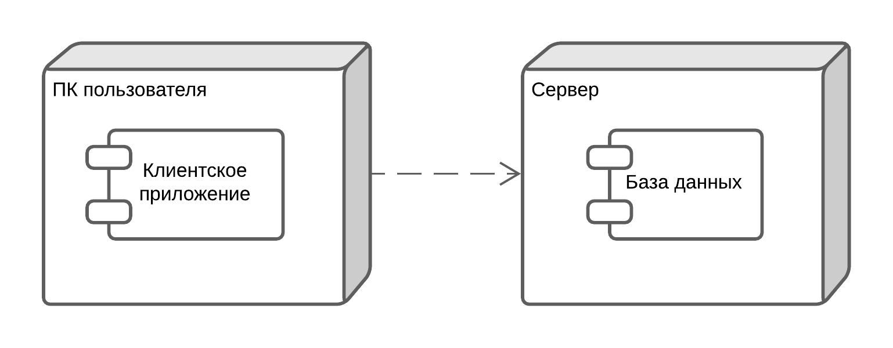

## Диаграмма размещения

+ Диаграмма размещения отражает физические взаимосвязи между программными и аппаратными компонентами системы. 
На диаграмме размещения изображены узлы выполнения программных компонентов, а также объектов. 
Показано, что клиентское приложение, установленное на компьютере пользователя, взаимодействует с сервером, который содержит в себе базу данных.
