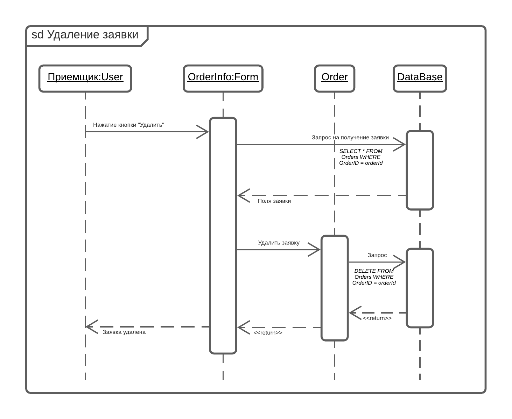

### Диаграммы последовательности

+ Диаграмма описывает процесс авторизации пользователя. Пользователь нажимает на форме авторизации кнопку «Вход». 
Затем выполняется функция получения списка пользователей с введенными логином и паролем. Если пользователь найден, то вход выполнен успешно.
 

+ Диаграмма описывает процесс просмотра списка заявок. Пользователь выбирает на главной форме вкладку «Заявки», в которой выполняется функция получения списка заявок. 
Из класса «allOrders» выполняется запрос базе данных на получение списка. 

+ Диаграмма описывает процесс добавления заявки. Пользователь нажимает на главной форме кнопку «Новая заявка». Создается пустой экземпляр класса Order. 
Затем пользователь заполняет данные о заявке. Происходит присвоение данных полям класса, после чего вызывается функция add(). 
После этого выполняется запрос на добавление клиента в базу данных. При успешном добавлении выводится сообщение, что заявка создана. 

+ Диаграмма описывает процесс редактирования данных заявки. Пользователь нажимает на форме с информацией о заявке кнопку «Изменить». Вызывается форма редактирования заявки. 
В классе «Orders» происходит запрос на получение полей заявки с заданным идентификатором. Затем пользователь изменяет данные о заявке. 
Происходит присвоение данных полям класса, после чего вызывается функция edit(). Выполняется запрос на редактирование заявки в БД. 
При успешном обновлении данных выводится сообщение, что данные о заявке изменены. 

+ Диаграмма описывает процесс удаления заявки. Пользователь нажимает на форме с информацией о заявке кнопку «Удалить». Вызывается функция del() для удаления заявки из программы. 
Далее выполняется запрос на удаление поля заявки с заданным идентификатором из БД. При успешном выполнении выводится сообщение, что заявка удалена. 
