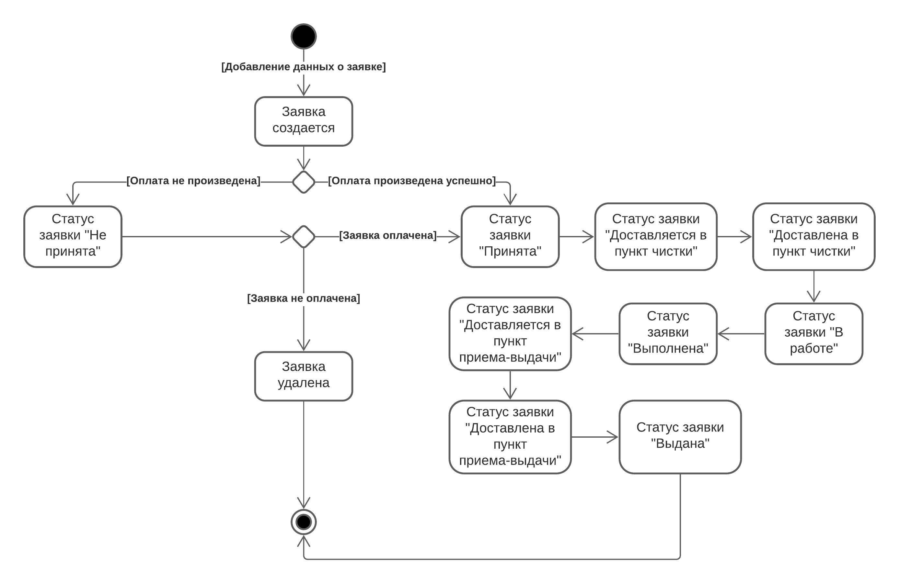

## Диаграмма состояний

+ Диаграмма описывает все возможные состояния заявки на продолжении ее жизненного цикла. Сначала заявка является пустой, далее, после заполнения всех полей заявки, 
определяется ее стоимость. Если заявка оплачена, то она получает статус «Принята», далее она получает статус «Доставляется в пункт чистки» и после доставки вещей в место, 
где будет производится чистка и др. услуги, получает статус «Доставлена в пункт чистки», статус «В работе» заявка будет иметь по мере выполнения, когда вещь/вещи очистят она 
получит статус «Выполнена», после получит статус «Доставляется в пункт-приема выдачи», когда все вещи вернут клиенту заявка получит статус «Выдана». 
Если оплата не произведена заявка получает статус «Не принята», далее производится попытка повторной оплаты, если она не проходит успешно, то заявка удаляется.
