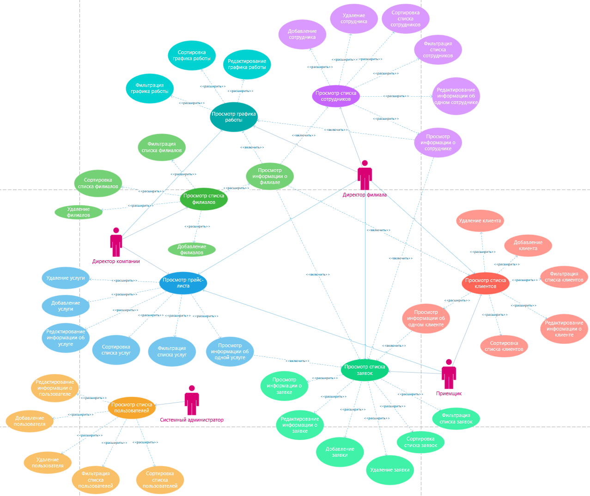

## Диаграмма прецедентов 

 

**Описание прецедента «Просмотр списка клиентов»**
+ *Имя прецедента:*	Просмотр списка клиентов.
+ *Краткое описание:*	Прецедент позволяет просматривать список всех клиентов филиала.
+ *Акторы:*	Директор филиала, Приемщик, Директор компании. 
+ *Предусловия:*	Должен быть хотя бы один клиент, если таковых нет, то пользователю «Приемщик» предлагается добавить нового клиента. Должен быть выполнен прецедент «Просмотр информации о филиале» для пользователя «Директор компании».
+ *Основной поток:*	Выводится информация обо всех клиентах филиала в виде таблицы.
+ *Постусловия:*	Если прецедент был успешно завершен, то пользователь может выполнять другие действия.
+ *Альтернативные потоки:* 	-

**Описание прецедента «Добавление клиента»**
+ *Имя прецедента:*	Добавление клиента.
+ *Краткое описание:*	Прецедент позволяет добавлять новых клиентов.
+ *Акторы:*	Приемщик.
+ *Предусловия:*	Должен быть выполнен прецедент «Просмотр списка клиентов».
+ *Основной поток:*	Открывается форма добавления клиента, куда вводятся все необходимые данные.
+ *Постусловия:*	Если прецедент был успешно завершен, то форма добавления клиента закрывается и в БД добавляется новый клиент.
+ *Альтернативные потоки:* Если имеются незаполненные поля, либо введены некорректные данные, то выводится сообщение об ошибке и пользователю предлагается заполнить все поля или исправить ошибки ввода.

**Описание прецедента «Редактирование информации о клиенте»**
+ *Имя прецедента:*	Редактирование информации о клиенте. 
+ *Краткое описание:*	Прецедент позволяет редактировать информацию о клиенте.
+ *Акторы:*	Приемщик. 
+ *Предусловия:*	Должен быть выполнен прецедент «Просмотр списка клиентов».
+ *Основной поток:*	Открывается форма редактирования информации о клиенте, где изменяются все необходимы данные.
+ *Постусловия:*	Если прецедент был успешно завершен, то форма редактирования закрывается и измененные данные о клиенте сохраняются.
+ *Альтернативные потоки:* 	Если имеются незаполненные поля, либо введены некорректные данные, то выводится сообщение об ошибке и пользователю предлагается заполнить все поля или исправить ошибки ввода.

**Описание прецедента «Просмотр информации об одном клиенте»**
+ *Имя прецедента:*	Просмотр информации об одном клиенте.
+ *Краткое описание:*	Прецедент позволяет просмотреть информацию об одном клиенте.
+ *Акторы:*	Приемщик, Директор филиала, Директор компании.
+ *Предусловия:*	Должен быть выполнен прецедент «Просмотр информации о филиале» для пользователя «Директор компании». Должен быть выполнен прецедент «Просмотр списка клиентов» для всех пользователей.
+ *Основной поток:*	Выводится информация об одном клиенте в виде таблицы.
+ *Постусловия:*	Если прецедент был успешно завершен, то пользователь может выполнять другие действия.
+ *Альтернативные потоки:* 	-

**Описание прецедента «Просмотр списка заявок»**
+ *Имя прецедента:*	Просмотр списка заявок.
+ *Краткое описание:*	Прецедент позволяет просматривать список всех заявок филиала.
+ *Акторы:*	Директор филиала, Приемщик, Директор компании.
+ *Предусловия:*	Должна быть хотя бы одна заявка, если таковых нет, то пользователю «Приемщик» предлагается создать новую заявку. Должен быть выполнен прецедент «Просмотр информации о филиале» для пользователя «Директор компании».
+ *Основной поток:*	Выводится информация обо всех заявках филиала в виде таблицы.
+ *Постусловия:*	Если прецедент был успешно завершен, то пользователь может выполнять другие действия
+ *Альтернативные потоки:* 	-

**Описание прецедента «Добавление заявки»**
+ *Имя прецедента:*	Добавление заявки.
+ *Краткое описание:*	Прецедент позволяет добавить заявку.
+ *Акторы:*	Приемщик.
+ *Предусловия:*	Должен быть выполнен прецедент «Просмотр списка заявок».
+ *Основной поток:*	Открывается форма добавления заявки, куда вводятся все необходимые данные.
+ *Постусловия:*	Если прецедент был успешно завершен, то форма добавления заявки закрывается и в БД добавляется новая заявка.
+ *Альтернативные потоки:* 	Если имеются незаполненные поля, либо введены некорректные данные, то выводится сообщение об ошибке и пользователю предлагается заполнить все поля или исправить ошибки ввода.

**Описание прецедента «Редактирование информации о заявке»**
+ *Имя прецедента:*	Редактирование информации о заявке.
+ *Краткое описание:*	Прецедент позволяет редактировать информацию об одной заявке.
+ *Акторы:*	Приемщик.
+ *Предусловия:*	Должен быть выполнен прецедент «Просмотр списка заявок».
+ *Основной поток:*	Открывается форма редактирования информации о заявке, куда вводятся все необходимые данные.
+ *Постусловия:*	Если прецедент был успешно завершен, то форма редактирования закрывается и новые данные о заявке сохраняются.
+ *Альтернативные потоки:* 	Если имеются незаполненные поля, либо введены некорректные данные, то выводится сообщение об ошибке и пользователю предлагается заполнить все поля или исправить ошибки ввода.

**Описание прецедента «Просмотр информации о заявке»**
+ *Имя прецедента:*	Просмотр информации о заявке.
+ *Краткое описание:*	Прецедент позволяет просмотреть информацию об одной заявке.
+ *Акторы:*	Приемщик, Директор филиала, Директор компании.
+ *Предусловия:*	Должен быть выполнен прецедент «Просмотр информации о филиале» для пользователя «Директор компании». Должен быть выполнен прецедент «Просмотр списка заявок» для всех пользователей.
+ *Основной поток:*	Выводятся данные об одной заявке в виде таблицы.
+ *Постусловия:*	Если прецедент был успешно завершен, то пользователь может выполнять другие действия.
+ *Альтернативные потоки:* 	-

**Описание прецедента «Просмотр списка сотрудников»**
+ *Имя прецедента:*	Просмотр списка сотрудников.
+ *Краткое описание:*	Прецедент позволяет просмотреть список всех сотрудников филиала.
+ *Акторы:*	Директор филиала, Директор компании.
+ *Предусловия:*	Должен быть хотя бы один сотрудник, если таковых нет, то пользователю предлагается добавить сотрудника. Должен быть выполнен прецедент «Просмотр информации о филиале» для пользователя «Директор компании».
+ *Основной поток:*	Выводится информация обо всех сотрудниках филиала в виде таблицы.
+ *Постусловия:*	Если прецедент был успешно завершен, то пользователь может выполнять другие действия.
+ *Альтернативные потоки:* 	-

**Описание прецедента «Добавление сотрудника»**
+ *Имя прецедента:*	Добавление сотрудника.
+ *Краткое описание:*	Прецедент позволяет добавить сотрудника.
+ *Акторы:*	Директор филиала, Директор компании.
+ *Предусловия:*	Должен быть выполнен прецедент «Просмотр информации о филиале» для пользователя «Директор компании». Должен быть выполнен прецедент «Просмотр списка сотрудников».
+ *Основной поток:*	Открывается форма добавления сотрудника, куда вводятся все необходимые данные.
+ *Постусловия:*	Если прецедент был успешно завершен, то форма добавления сотрудника закрывается и в БД добавляется новый сотрудник.
+ *Альтернативные потоки:* 	Если имеются незаполненные поля, либо введены некорректные данные, то выводится сообщение об ошибке и пользователю предлагается заполнить все поля или исправить ошибки ввода.

**Описание прецедента «Редактирование информации об одном сотруднике»**
+ *Имя прецедента:*	Редактирование информации об одном сотруднике.
+ *Краткое описание:*	Прецедент позволяет редактировать информацию о сотруднике.
+ *Акторы:*	Директор филиала, Директор компании.
+ *Предусловия:*	Должен быть выполнен прецедент «Просмотр списка сотрудников».
+ *Основной поток:*	Открывается форма редактирования информации о сотруднике, куда вводятся все необходимые данные.
+ *Постусловия:*	Если прецедент был успешно завершен, то форма редактирования закрывается и измененные данные сохраняются.
+ *Альтернативные потоки:* 	Если имеются незаполненные поля, либо введены некорректные данные, то выводится сообщение об ошибке и пользователю предлагается заполнить все поля или исправить ошибки ввода.

**Описание прецедента «Удаление сотрудника»**
+ *Имя прецедента:*	Удаление сотрудника.
+ *Краткое описание:*	Прецедент позволяет удалить сотрудника.
+ *Акторы:*	Директор филиала, Директор компании.
+ *Предусловия:*	Должен быть выполнен прецедент «Просмотр списка сотрудников».
+ *Основной поток:*	При нажатии на кнопку «Удалить», текущая запись удаляется.
+ *Постусловия:*	Если прецедент был успешно завершен, то сотрудник удаляется из БД.
+ *Альтернативные потоки:* 	-

**Описание прецедента «Просмотр информации о сотруднике»** 
+ *Имя прецедента:*	Просмотр информации о сотруднике.
+ *Краткое описание:*	Прецедент позволяет просмотреть информацию о сотруднике.
+ *Акторы:*	Директор филиала, Директор компании.
+ *Предусловия:*	Должен быть выполнен прецедент «Просмотр информации о филиале» для пользователя «Директор компании». Должен быть выполнен прецедент «Просмотр списка сотрудников».
+ *Основной поток:*	Выводится информация об одном сотруднике в виде таблицы.
+ *Постусловия:*	Если прецедент был успешно завершен, то пользователь может выполнять другие действия.
+ *Альтернативные потоки:* 	-

**Описание прецедента «Просмотр графика работы»** 
+ *Имя прецедента:*	Просмотр графика работы.
+ *Краткое описание:*	Прецедент позволяет просмотреть график работы.
+ *Акторы:*	Директор компании, Директор филиала.
+ *Предусловия:*	Если график работы пуст, то пользователю «Директор филиала» предлагается его заполнить. Пользователь «Директор компании» может просмотреть график работы всего предприятия, одного филиала или одного сотрудника. Для того чтобы пользователю «Директор компании» просмотреть график работы филиала, нужно выполнить прецеденты «Просмотр списка филиалов» -> «Просмотр информации о филиале», график работы одного сотрудника: «Просмотр списка филиалов» -> «Просмотр информации о филиале» -> «Просмотр списка сотрудников» -> «Просмотр информации о сотруднике». Пользователь «Директор филиала» может просмотреть график работы филиала и одного сотрудника. Для того чтобы пользователю «Директор филиала» просмотреть график работы одного сотрудника, нужно выполнить прецеденты «Просмотреть список сотрудников» -> «Просмотр информации о сотруднике».
+ *Основной поток:*	Выводится информация о графике работы в виде таблицы.
+ *Постусловия:*	Если прецедент был успешно завершен, то пользователь может выполнять другие действия.
+ *Альтернативные потоки:* 	-

**Описание прецедента «Редактирование графика работы»** 
+ *Имя прецедента:*	Редактирование графика работы.
+ *Краткое описание:*	Прецедент позволяет редактировать график работы.
+ *Акторы:*	Директор филиала.
+ *Предусловия:*	Должен быть выполнен прецедент «Просмотр графика работы». Если редактировать график работы одного сотрудника, то должны быть выполнены прецеденты: «Просмотр списка клиентов» -> «Просмотр информации о сотруднике»  -> «Просмотр графика работы».
+ *Основной поток:*	Открывается форма редактирования графика работы, где изменяются все необходимы данные.
+ *Постусловия:*	Если прецедент был успешно завершен, то форма редактирования закрывается и измененные данные сохраняются.
+ *Альтернативные потоки:* 	Если имеются незаполненные поля, либо введены некорректные данные, то выводится сообщение об ошибке и пользователю предлагается заполнить все поля или исправить ошибки ввода.

**Описание прецедента «Просмотр списка филиалов»** 
+ *Имя прецедента:*	Просмотр списка филиалов.
+ *Краткое описание:*	Прецедент позволяет просмотреть список филиалов.
+ *Акторы:*	Директор компании.
+ *Предусловия:*	Должен быть хотя бы один филиал, если таковых нет, то пользователю предлагается добавить филиал.
+ *Основной поток:*	Выводится информация обо всех филиалах в виде таблицы.
+ *Постусловия:*	Если прецедент был успешно завершен, то пользователь может выполнять другие действия.
+ *Альтернативные потоки:* 	-

**Описание прецедента «Добавление филиала»** 
+ *Имя прецедента:*	Добавление филиала.
+ *Краткое описание:*	Прецедент позволяет добавить филиал.
+ *Акторы:*	Директор компании.
+ *Предусловия:*	Должен быть выполнен прецедент «Просмотр списка филиалов».
+ *Основной поток:*	Открывается форма добавления филиала, куда вводятся все необходимые данные.
+ *Постусловия:*	Если прецедент был успешно завершен, то форма добавления филиала закрывается и в БД добавляется новый филиал.
+ *Альтернативные потоки:* 	Если имеются незаполненные поля, либо введены некорректные данные, то выводится сообщение об ошибке и пользователю предлагается заполнить все поля или исправить ошибки ввода.

**Описание прецедента «Удаление филиала»** 
+ *Имя прецедента:*	Удаление филиала.
+ *Краткое описание:*	Прецедент позволяет удалить филиал.
+ *Акторы:*	Директор компании.
+ *Предусловия:*	Должен быть выполнен прецедент «Просмотр списка филиалов».
+ *Основной поток:*	При нажатии на кнопку «Удалить», текущая запись удаляется.
+ *Постусловия:*	Если прецедент был успешно завершен, то филиал удаляется из БД.
+ *Альтернативные потоки:* 	-

**Описание прецедента «Просмотр информации о филиале»** 
+ *Имя прецедента:*	Просмотр информации о филиале.
+ *Краткое описание:*	Прецедент позволяет просмотреть информацию об одном филиале.
+ *Акторы:*	Директор компании.
+ *Предусловия:*	Должен быть выполнен прецедент «Просмотр списка филиалов».
+ *Основной поток:*	Выводятся данные об одном филиале в виде таблицы.
+ *Постусловия:*	Если прецедент был успешно завершен, то пользователь может выполнять другие действия.
+ *Альтернативные потоки:* 	-

**Описание прецедента «Просмотр прайс-листа»** 
+ *Имя прецедента:*	Просмотр прайс-листа.
+ *Краткое описание:*	Прецедент позволяет просматривать список услуг и цен на них.
+ *Акторы:*	Директор филиала, Приемщик, Директор компании.
+ *Предусловия:*	Должна быть хотя бы одна услуга, если таковых нет, то пользователю «Директор компании» предлагается создать новую услугу.
+ *Основной поток:*	Выводится информация обо всех услугах в виде таблицы.
+ *Постусловия:*	Если прецедент был успешно завершен, то пользователь может выполнять другие действия.
+ *Альтернативные потоки:* 	-

**Описание прецедента «Добавление услуги»** 
+ *Имя прецедента:*	Добавление услуги.
+ *Краткое описание:*	Прецедент позволяет добавить услугу.
+ *Акторы:*	Директор компании.
+ *Предусловия:*	Должен быть выполнен прецедент «Просмотр прайс-листа».
+ *Основной поток:*	Открывается форма добавления услуги, куда вводятся все необходимые данные.
+ *Постусловия:*	Если прецедент был успешно завершен, то форма добавления услуги закрывается и в БД добавляется новая услуга.
+ *Альтернативные потоки:* 	Если имеются незаполненные поля, либо введены некорректные данные, то выводится сообщение об ошибке и пользователю предлагается заполнить все поля или исправить ошибки ввода.

**Описание прецедента «Редактирование информации об услуге»** 
+ *Имя прецедента:*	Редактирование информации об услуге.
+ *Краткое описание:*	Прецедент позволяет редактировать информацию об услуге.
+ *Акторы:*	Директор компании.
+ *Предусловия:*	Должен быть выполнен прецедент «Просмотр прайс-листа».
+ *Основной поток:*	Открывается форма редактирования информации об услуге, куда вводятся все необходимые данные.
+ *Постусловия:*	Если прецедент был успешно завершен, то форма редактирования закрывается и новые данные об услуге сохраняются.
+ *Альтернативные потоки:* 	Если имеются незаполненные поля, либо введены некорректные данные, то выводится сообщение об ошибке и пользователю предлагается заполнить все поля или исправить ошибки ввода.

**Описание прецедента «Просмотр информации об одной услуге»** 
+ *Имя прецедента:*	Просмотр информации об одной услуге.
+ *Краткое описание:*	Прецедент позволяет просмотреть информацию об одной услуге.
+ *Акторы:*	Приемщик, Директор филиала, Директор компании.
+ *Предусловия:*	Должен быть выполнен прецедент «Просмотр прайс-листа».
+ *Основной поток:*	Выводятся данные об одной услуге в виде таблицы.
+ *Постусловия:*	Если прецедент был успешно завершен, то пользователь может выполнять другие действия.
+ *Альтернативные потоки:* 	-

**Описание прецедента «Удаление услуги»** 
+ *Имя прецедента:*	Удаление услуги.
+ *Краткое описание:*	Прецедент позволяет удалить услугу.
+ *Акторы:*	Директор компании.
+ *Предусловия:*	Должен быть выполнен прецедент «Просмотр прайс-листа».
+ *Основной поток:*	При нажатии на кнопку «Удалить», текущая запись удаляется.
+ *Постусловия:*	Если прецедент был успешно завершен, то услуга удаляется из БД.
+ *Альтернативные потоки:* 	-
